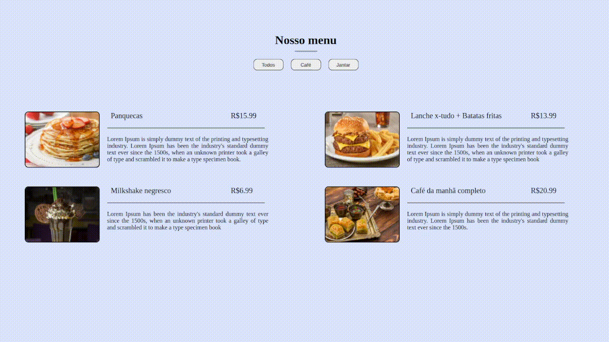

# Menu de restaurante

## Sobre o projeto:

Este projeto é uma página de menu de restaurante, que filtra os diferentes menus de comida disponíveis. 
Foi possível atribuir aprendizados sobre funções de ordem superior, como map, reduce e filter.

## Funcionamento do projeto:

  

## Conceitos tratados:

- arrays;
- objects;
- forEach();
- DOMContentLoaded;
- map, reduce and filter;
- innerHTML;
- includes method;

